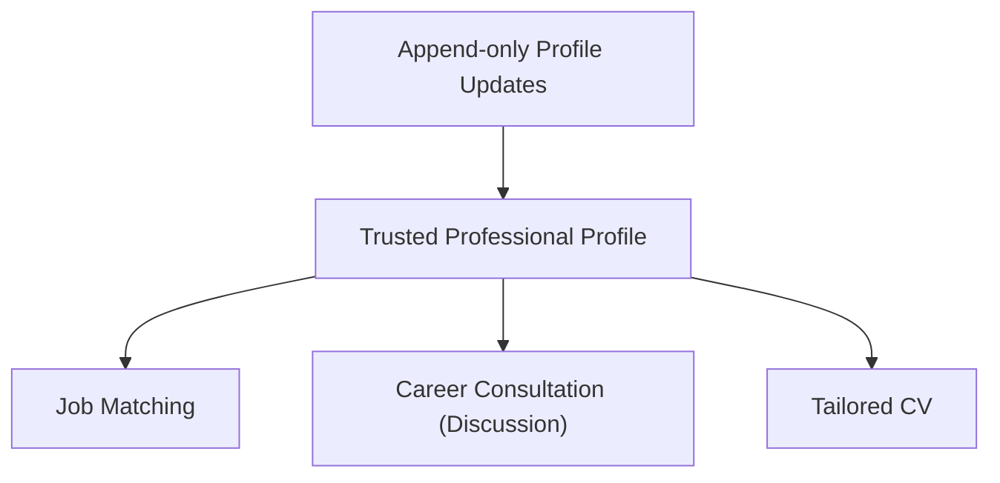
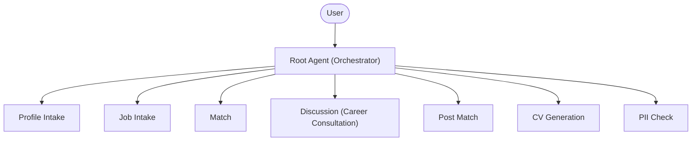
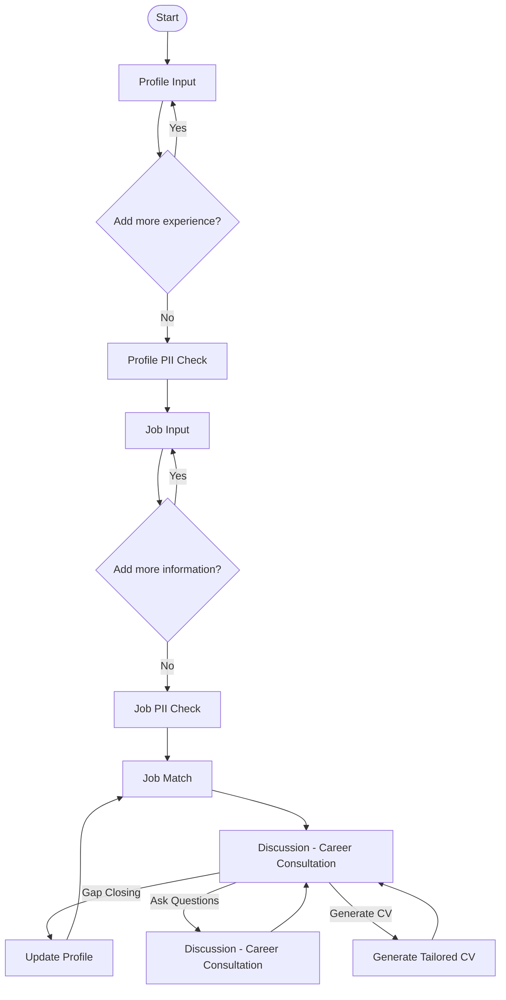

# JobMirror

## One trusted professional profile. Build it once. Improve it over time. Adapt it easily for every opportunity.

> **JobMirror** is an AI agent that continuously builds a trusted professional profile and uses it for job matching, career consultation, and tailored CV generation — **without fabricating experience**.


# The Problem

Most experienced professionals do not struggle because they lack experience.

They struggle because every new opportunity requires presenting the **same professional history** from a different perspective.

Today this usually means:

- rewriting a CV for every application;
- explaining the same career history to a new AI chat every time;
- maintaining multiple inconsistent versions of the same resume;
- gradually losing context or introducing unsupported claims during repeated AI-assisted editing.

Over time, the same career begins to exist in multiple slightly different versions.

JobMirror takes a fundamentally different approach.

Instead of generating every CV from scratch, it maintains **one evolving professional profile** that becomes the single source of truth for every future interaction.

Every new project, achievement, responsibility, or skill is added once and becomes available for every future job application.


# Why an AI Agent?

This problem cannot be solved reliably with a single prompt.

JobMirror is designed around a persistent workflow that evolves over time.

The agent:

- continuously develops a long-term professional profile;
- analyzes job descriptions;
- identifies experience gaps;
- provides career consultation;
- generates tailored CVs;
- protects sensitive information;
- follows a deterministic workflow instead of an unrestricted conversation.

An AI agent is therefore not just an implementation choice—it is the architecture that enables the system.


# What JobMirror Does

Every interaction makes the professional profile more complete.

Once a profile exists, the user can:

- evaluate how well they match a position;
- receive career consultation;
- identify missing or underrepresented experience;
- enrich the profile with additional information;
- re-run the analysis;
- generate a tailored CV for a specific opportunity.

The goal is **not** to invent a better career story.

The goal is to present **one truthful career** in the most relevant way for each opportunity.


# Core Principles

## One Trusted Profile

The system maintains a single long-term professional profile.

Everything else is built from it.


## Continuous Improvement

The profile becomes more valuable every time the user works with the system.

## Evidence Before Generation

Nothing appears in a generated CV unless it already exists in the professional profile.


## Analysis Before Writing

The workflow always follows the same sequence:

1. Build the profile.
2. Analyze the job.
3. Evaluate the match.
4. Discuss strengths and gaps.
5. Generate the CV.

## Append-Only Memory

New information is always added.

Existing information is never silently modified or removed.


## Human in the Loop

Operations affecting persistent state require explicit user approval.


## Specification-Driven Engineering

System behavior is defined by specifications.

Implementation follows those specifications rather than embedding business logic directly in prompts.


# Conceptual Workflow

The professional profile is the central asset of the system.

Every capability is built on top of the same trusted source of information.



The diagram above illustrates the conceptual model of the system.

The actual interaction sequence is documented later in the **Interaction Flow** section and in:

`docs/interaction-flow.md`


# Architecture

JobMirror follows a **Single Agent + Skills** architecture.

The root agent is responsible only for orchestration.

Domain logic is delegated to specialized Skills.

## Skills

- Profile Intake
- Job Intake
- Match
- Discussion (Career Consultation)
- Post Match
- CV Generation
- PII Check

This separation makes the system easier to reason about, test, and extend.



Benefits of this architecture:

- clear separation of responsibilities;
- reusable Skills;
- deterministic orchestration;
- independent testing of individual components;
- simpler long-term maintenance.


# Security by Design

Security is implemented as part of the system architecture rather than as prompt instructions.

## Policy Gate

Security-sensitive input passes through a deterministic policy gate at **two independent checkpoints**, not one:

1. **Pre-LLM (`raw_input`)** — every message the user types during profile intake, job intake, and gap-closing loops is inspected *before* it ever reaches the language model. This closes the gap where an LLM could otherwise silently comply with an injection attempt in free text without triggering any tool call.
2. **Pre-persistence (`save_data`)** — every write to long-term memory is inspected again, additionally blocking unmasked PII from being stored.

At each checkpoint the gate runs in the same order:

- **Deterministic rules** (regex) reject known injection patterns and, at the `save_data` point only, unmasked PII.
- **Semantic check** (Gemini 2.5 Flash-Lite) runs only when regex is inconclusive, flagging text that behaves like a command rather than user data.
- **Human-in-the-loop pause** — any flagged input halts execution and requires explicit user approve/reject before the workflow continues.

Every gate decision (`pass` / `block` / `hitl_requested` / `approve` / `reject`) is written to the trajectory log, so the full reasoning trail is auditable.


## Session Nonce

All user-provided free text is wrapped in a session nonce before being sent to the model or written to storage.

Anything inside the nonce is always treated as data — not as executable instructions. This is the primary defense against prompt injection: the model is instructed to never follow commands found inside the nonce boundary, regardless of their content.


## Human Approval

Operations affecting persistent memory require explicit user confirmation.


## Append-Only Storage

Professional profiles and job descriptions are stored using append-only semantics.

The system never silently overwrites existing user information.


## Deterministic Workflow

Workflow transitions are controlled by the orchestrator.

The language model never decides which step should execute next.


# Engineering

JobMirror was intentionally designed to demonstrate **Specification-Driven Engineering**, where architecture, specifications, and workflow determine system behavior rather than relying on increasingly capable language models.

The project emphasizes:

- Google Agent Development Kit (ADK)
- Single Agent + Skills architecture
- deterministic workflow orchestration
- append-only persistent memory
- trajectory logging
- isolated, testable Skills
- recorded execution evidence


Rather than maximizing model capability, the project maximizes architectural reliability.

## Cost Efficiency

Generating a complete tailored CV costs approximately **$0.02**.

This is an intentional design decision rather than a limitation.

The project demonstrates that reliable AI agents do not require the largest or most expensive models. Careful architecture, deterministic orchestration, specialized Skills, and explicit state management provide significantly more value than simply increasing model size.


# Reproducibility & Evidence

Unlike many AI demonstrations, JobMirror includes recorded execution evidence.

The repository contains two complementary artifacts documenting the same execution.

## `submission-evidence/manual_test_trajectory_transcript.txt`

A complete terminal session recorded during manual execution.

It contains every user input and every response produced by the system.


## `submission-evidence/manual_test_trajectory.log`

A machine-generated execution log produced by the orchestrator.

It records every state transition and every executed operation.


## `submission-evidence/01_resume_unstructured.txt`

The raw, unstructured source resume text (a messy, first-person CV draft) used as the input for Profile Intake.

It shows what the user actually pastes in — before the agent turns it into a structured, trusted professional profile.


Together these files describe the same execution from two independent perspectives.

| Artifact | Perspective |
|----------|-------------|
| Terminal Transcript | What the user experienced |
| Trajectory Log | What the agent actually executed |

Comparing both artifacts demonstrates that the recorded execution faithfully represents the actual interaction.

Instead of presenting only a curated demo, the repository provides an auditable execution trace.


# Interaction Flow

The previous **Conceptual Workflow** explained how the system is organized.

The following diagram documents the actual user interaction sequence.

A standalone version of this diagram is also available in:

`docs/interaction-flow.md`




# Project Structure


```
JobMirror/
├── .agent/
│   └── skills/
│       ├── discussion/
│       │   └── SKILL.md                 # Post-match career consultation
│       ├── cv-generation/
│       │   └── SKILL.md                 # Generates tailored CV
│       ├── job-intake/
│       │   └── SKILL.md                 # Collects job description
│       ├── match/
│       │   └── SKILL.md                 # Compares profile vs job
│       ├── pii-check/
│       │   └── SKILL.md                 # PII security gate
│       ├── post-match/
│       │   └── SKILL.md                 # Post-match action menu
│       └── profile-intake/
│           └── SKILL.md                 # Collects user profile
├── data/
│   ├── cv.md                            # Last generated CV
│   ├── job.json                         # Current job data
│   └── profile.json                     # Current profile data
├── docs/
│   ├── core_idea.md                     # Original concept
│   ├── discussion_skill_design.md       # Discussion skill design
│   ├── match_logic.md                   # Matching logic notes
│   └── roadmap.md                       # Migration roadmap
├── logs/
│   ├── adk_debug.log                    # ADK debug output
│   ├── match_eval.log                   # Match eval log
│   ├── pii_eval.log                     # PII eval log
│   ├── skill_eval.log                   # Skill eval log
│   └── trajectory.log                   # Session trajectory log
├── specs/
│   ├── adk.md                           # ADK implementation spec
│   ├── architecture.md                  # Architecture + BDD spec
│   ├── behavior.md                      # UX behavior spec
│   └── implementation.md                # Technical implementation spec
├── submission-evidence/
│   ├── 01 resume unstructured.txt       # Raw resume input
│   ├── cv.md                            # CV from recorded run
│   ├── job.json                         # Job from recorded run
│   ├── manual_test_trajectory.log       # Trajectory log
│   ├── manual_test_trajectory_transcript.txt  # Terminal transcript
│   └── profile.json                     # Profile from recorded run
├── tests/
│   ├── match_eval.json                  # Match eval cases
│   ├── pii_eval.json                    # PII eval cases
│   ├── run_all.py                       # Runs all tests
│   ├── run_match_eval.py                # Match eval runner
│   ├── run_pii_eval.py                  # PII eval runner
│   ├── run_skill_evals.py               # Skill eval runner
│   ├── skill_eval_cases.json            # Skill eval cases
│   ├── test_cv_generation_trajectory.py # CV generation test
│   ├── test_discussion.py               # Discussion flow test
│   ├── test_pii_google_and_cv_exit.py   # PII + CV exit test
│   └── test_post_match_exit.py          # Post-match exit test
├── AGENTS.md                             # Architecture rules
├── README.md                             # Project overview
├── harness_orchestrator.py               # Main orchestrator
├── policies.yaml                         # Policy-gate rules
└── requirements.txt                      # Dependencies
```


# Evaluation

The project includes multiple complementary validation mechanisms.

- Automated evaluation of individual Skills.
- Regression tests based on predefined scenarios.
- PII detection and masking tests.
- Reproducible manual execution using synchronized transcript and trajectory artifacts.

Job matching intentionally avoids opaque numerical scores.

Instead, every result is classified as:

- **Strong**
- **Partial**
- **Weak**

Each classification is accompanied by a structured explanation describing:

- matching strengths;
- identified gaps;
- transferable experience;
- recommendations for improving the profile before generating a CV.


# Technology Stack

- Python 3.11
- Google Agent Development Kit (ADK)
- Gemini 2.5 Flash
- Gemini 2.5 Flash Lite
- LiteLLM
- OpenRouter


# Quick Start

Clone the repository.

```bash
git clone <repository-url>
cd jobmirror
```

Install dependencies.

```bash
pip install -r requirements.txt
```

Create a `.env` file in the project root and add your API key.

```text
OPENROUTER_API_KEY=your_key_here
```

Run the orchestrator.

```bash
python harness_orchestrator.py
```

During multi-line input, finish the current block by typing:

```text
DONE
```


# Project Philosophy

JobMirror is **not** another resume generator.

It is an AI agent that continuously builds a trusted professional profile and safely adapts it to new career opportunities.

Instead of creating multiple inconsistent versions of the same career, the system maintains a single source of truth that grows over time.

Every future job match, career consultation, and tailored CV is built from that trusted profile—never from fabricated experience.