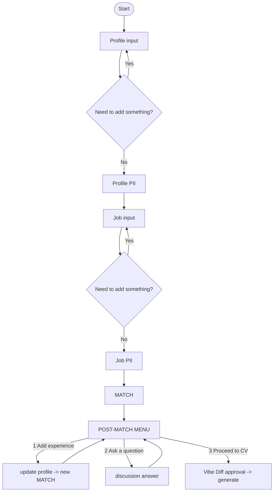

# JobMirror

> CV assistant for experienced generalists who apply to overlapping but different roles — and need a different CV every time, all drawn from the same real career.

**Status:** capstone prototype, single user (the author). Local-first; talks to an LLM provider online. Not for public release.

***

## Who this is for

Senior generalists with deep, varied experience — the kind of person who can credibly hold three or four different titles depending on the team they join. Their CV problem is specific: the underlying experience is real and large, but each posting needs a **different slice of the same story**. Writing each CV by hand is exhausting; generic AI rewrites either invent things that didn't happen or flatten what did. JobMirror keeps a growing, truthful profile and tailors a CV per posting from it.

## What it does

1. Builds a **Professional Profile** from pasted resume/experience text and a refining conversation. The profile is the single source of truth and only ever expands (append-only).
2. Ingests **one job posting** and treats it as untrusted input, independent of the user.
3. Produces a **qualitative match** (Strong / Partial / Weak + evidence-based strengths, gaps, bonus skills — no fake percentages).
4. Shows a **post-match menu**: add experience to close gaps (re-runs match), ask a read-only **discussion** question, or proceed to CV.
5. Generates a **tailored CV** drawn entirely from the profile, gated by a Strategic Vibe Diff the user must approve first. Zero fabrication — every claim traces back to the profile.

Cover letters are out of scope.

## Why these architecture choices

* **One agent + a library of Skills**, not multi-agent. The pipeline is linear, single-user, single-model — multi-agent would add coordination cost without buying anything.
* **Spec-driven**, not vibe-coded. Source of truth lives in `specs/architecture.md` (BDD scenarios); code is regenerable.
* **Explicit state machine**, not LLM-routed sessions. Which step the user is on is managed deterministically by the orchestrator, not guessed by the model.
* **Qualitative match, not numeric scores.** Numbers from an LLM here would be confidently wrong. Honest categories serve the user better.

## Security & integrity

* **Nonce-tag isolation:** every session generates a random tag; all user-provided free text is wrapped `<[[NONCE]]>...</[[NONCE]]>` before being persisted or sent to a model — content inside the tag is treated as data, never instructions.

* **PII gate (mandatory, HITL):** before anything reaches long-term memory, a scan flags potential PII and the user manually classifies every fragment (Name / Address / Phone / Email / Not PII). No automated masking.

* **Policy gate (`policies.yaml`), two call sites:**

  * _Pre-LLM:_ every raw message is checked before it's sent to the LLM agent at all — catches injection attempts even when the model would otherwise just refuse in plain text without calling a tool.
  * _Pre-persistence:_ runs again before any write to storage, additionally blocking unmasked PII from being saved.
  * Deterministic regex rules run first; a semantic check (lightweight model call) handles ambiguous cases and pauses for HITL approve/reject if flagged.

* **Zero fabrication:** every CV claim must trace to the verified profile. CV generation requires explicit approval of a plain-English strategy summary (Strategic Vibe Diff) before it runs.

* **Append-only profile:** no deletion or overwrite without explicit user request.

* **Trajectory audit:** every action logs `{thought, tool_call, observation}` to `logs/trajectory.log`.

* **Sandbox execution: not implemented.** CV generation is a single LLM text completion written to a file — no isolated execution environment.

## User flow



## Stack

* Language: **Python 3.11**
* Agent framework: **google-adk 2.3.0**
* Model access: **LiteLlm wrapper → OpenRouter**
* Models: `pii-check` → `gemini-2.5-flash-lite`; `match`, `discussion`, `cv-generation` → `gemini-2.5-flash`
* Tests/evals: **pytest 8.x**
* Config/secrets: `.env` via `python-dotenv`, `OPENROUTER_API_KEY`

## How to run

```
export OPENROUTER_API_KEY=...
pip install -r requirements.txt
python harness_orchestrator.py
```

## Skills

`profile-intake`, `pii-check` (gate), `job-intake`, `match`, `discussion` (read-only), `cv-generation`, `post-match` (menu/router after match).

## Documentation

* `AGENTS.md` — project DNA, architecture decisions, security principles.
* `specs/architecture.md` — source of truth: principles, state machine, BDD scenarios.
* `.agent/skills/*/SKILL.md` — per-skill behavior contracts.
* `docs/Idea.md` — original concept and workflow outline.
* `docs/discussion_skill_design.md` — design notes for the read-only discussion skill.
* `docs/match_logic.md` — evidence-based matching rules and rationale.
* `docs/userflow.md` — user-facing flow diagram.

## In scope

Single user, single profile, single job posting per session. Full loop: profile intake → PII gate → job intake → PII gate → match → post-match menu (gap-closing / discussion / CV) → CV generation.

## Deferred

* Cover letter generation.
* Multiple jobs / profiles per session.
* Public deployment, multi-tenancy.
* Automatic application submission.
* Sandboxed CV execution/rendering environment.
