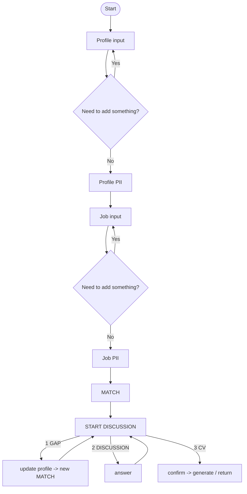

```mermaid
flowchart TD
    Start([Start]) --> ProfileInput[Profile input]
    ProfileInput --> ProfileAdd{Need to add something?}
    ProfileAdd -->|Yes| ProfileInput
    ProfileAdd -->|No| ProfilePII[Profile PII]
    ProfilePII --> JobInput[Job input]
    JobInput --> JobAdd{Need to add something?}
    JobAdd -->|Yes| JobInput
    JobAdd -->|No| JobPII[Job PII]
    JobPII --> Match[MATCH]
    Match --> Discussion[START DISCUSSION]
    Discussion -->|1 GAP| Gap[update profile -> new MATCH]
    Gap --> Discussion
    Discussion -->|2 DISCUSSION| Answer[answer]
    Answer --> Discussion
    Discussion -->|3 CV| CV[confirm -> generate / return]
```
